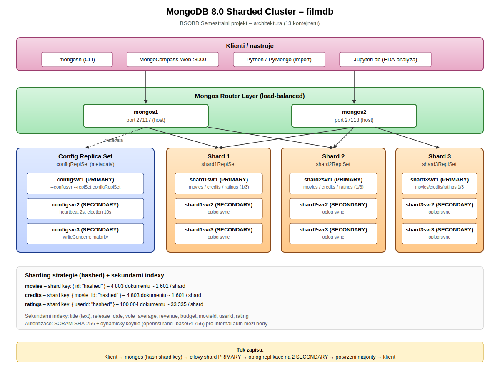

# Semestrální práce BSQBD
# NoSQL dokumentová databáze – MongoDB

**Student:** Kobrle Štěpán
**Fakulta:** Fakulta elektrotechnická (FEI)
**Předmět:** BSQBD – Big Data
**Téma:** Téma 2 – NoSQL databáze dokumentová – MongoDB
**Datum odevzdání:** 2026

---

## Obsah

1. [Úvod](#úvod)
2. [Architektura](#1-architektura)
   - 1.1 [Schéma a popis architektury](#11-schéma-a-popis-architektury)
   - 1.2 [Specifika konfigurace](#12-specifika-konfigurace)
     - 1.2.1 [CAP teorém](#121-cap-teorém)
     - 1.2.2 [Cluster](#122-cluster)
     - 1.2.3 [Uzly](#123-uzly)
     - 1.2.4 [Sharding / Partitioning](#124-sharding--partitioning)
     - 1.2.5 [Replikace](#125-replikace)
     - 1.2.6 [Perzistence dat](#126-perzistence-dat)
     - 1.2.7 [Distribuce dat](#127-distribuce-dat)
     - 1.2.8 [Zabezpečení](#128-zabezpečení)
3. [Funkční řešení](#2-funkční-řešení)
   - 2.1 [Struktura projektu](#21-struktura-projektu)
     - 2.1.1 [docker-compose.yml](#211-docker-composeyml)
   - 2.2 [Instalace a spuštění](#22-instalace-a-spuštění)
4. [Případy užití a případové studie](#3-případy-užití-a-případové-studie)
5. [Výhody a nevýhody](#4-výhody-a-nevýhody)
6. [Další specifika](#5-další-specifika)
7. [Data](#6-data)
8. [Dotazy](#7-dotazy)
9. [Závěr](#závěr)
10. [Zdroje a nástroje](#zdroje-a-nástroje)

---

# Úvod

Tato semestrální práce se zabývá návrhem, nasazením a použitím **NoSQL dokumentové databáze MongoDB** v režimu **sharded clusteru s replikací**. Předmětem práce je praktická ukázka schopností MongoDB v oblasti distribuovaného uložení dat, horizontálního škálování (sharding), vysoké dostupnosti (replikace s automatickou election) a agregační analytiky nad vícerozměrnými daty.

**Čtenář se v práci dozví:**

- Jak je postavena architektura sharded clusteru MongoDB (config servery, shardy, mongos routery).
- Jak konkrétně je nasazen a nakonfigurován cluster pomocí Docker Compose vč. dvoufázové inicializace s dynamicky generovaným keyfile.
- Jak MongoDB řeší CAP teorém, replikaci, perzistenci dat (WiredTiger storage engine, journaling) a zabezpečení (SCRAM-SHA-256 + RBAC + keyfile).
- Jak probíhá distribuce dat mezi shardy při použití hashed shardingu a jak lze analyzovat rozložení dokumentů.
- Jak vypadá netriviální agregační dotazování pomocí agregační pipeline (`$lookup`, `$unwind`, `$group`, `$bucket`, `$facet`, `$switch`, `$indexStats`, `$collStats`) nad třemi propojenými filmovými datasety.
- Jak provést EDA analýzu vstupních dat v Pythonu (Pandas, Matplotlib) a automatizovaný import dat do shardované databáze přes PyMongo.
- Jaké jsou typické případy užití MongoDB a srovnání s jinými NoSQL technologiemi (Redis, Cassandra).

**Co není součástí práce (vzhledem k tématu by mohlo být):**

- Produkční nasazení s geograficky distribuovanými shardy (multi-region setup).
- Implementace Change Streams a reaktivní pipeline (MongoDB Change Data Capture).
- MongoDB Atlas (cloudová managed služba) – projekt běží čistě self-hosted v Dockeru.
- Šifrování dat v klidu (Encryption-at-Rest s KMIP) – v akademickém prostředí postačí interní auth.
- Používání MongoDB Time Series kolekcí (bylo by relevantní pro telemetrická data).
- Pokročilé backup strategie (mongodump/mongorestore s point-in-time recovery).

**Použitá verze MongoDB: 8.0** (aktuální hlavní větev v době zpracování; splňuje podmínku max. 3 verze zpět od aktuální).

**Použité Docker obrazy:**

| Obraz | Zdroj | Zdůvodnění volby |
|-------|-------|------------------|
| `mongo:8.0` | Docker Hub (oficiální) | Stabilní oficiální obraz udržovaný společností MongoDB Inc., obsahuje `mongod`, `mongos` i `mongosh`, podporuje config server, shard server i router režim přes startup flagy. |
| `haohanyang/compass-web:latest` | Docker Hub (community) | Webová verze nástroje MongoDB Compass – umožňuje průzkum databáze v prohlížeči bez nutnosti lokální instalace Compass desktop aplikace. Požadavek zadání na přítomnost Compass (viz téma č. 2). |
| `alpine:3.19` | Docker Hub (oficiální) | Minimalistický obraz (~8 MB) využitý v kontejneru `keyfile-generator` pro dynamické vygenerování keyfile přes `openssl rand -base64 756`. |
| `python:3.11-slim` | Docker Hub (oficiální) | Runtime pro `data-import` kontejner; slim varianta bez zbytečných systémových knihoven. Doinstalovává `pymongo` a `pandas` za běhu. |

Projekt není postaven na vlastním Dockerfile – všechny služby používají upstream obrazy beze změny, pouze s parametrizovaným startup skriptem. To zjednodušuje údržbu a reprodukovatelnost.

---

# 1. Architektura

## 1.1 Schéma a popis architektury

Schéma architektury je znázorněno v **obrázku 1** (soubor [`dokumentace/obrazky/schema_architektury.svg`](obrazky/schema_architektury.svg)).



**Obrázek 1** – Architektura MongoDB 8.0 Sharded Clusteru: 3 config servery (configReplSet) uchovávají metadata shardingu, 3 shardy po 3 replikovaných nodech (shard{1,2,3}ReplSet) drží vlastní data, 2 mongos routery routují dotazy klientů, MongoCompass Web poskytuje UI. Celkem 13 kontejnerů.

### Popis architektury

Nasazení se skládá z **13 Docker kontejnerů** organizovaných do několika funkčních vrstev:

**1. Config Replica Set (configReplSet)** – 3 nody (`configsvr1`, `configsvr2`, `configsvr3`). Config servery uchovávají *metadata* clusteru: jaké shardy existují, jaká je konfigurace shardovaných kolekcí, mapování chunků na shardy a stav balanceru. Bez config serverů by mongos routery neuměly rozhodnout, kam zaslat dotaz. Tvoří samostatný replica set (3 nody pro majority quorum) – výpadek 1 nodu nezpůsobí výpadek clusteru.

**2. Shard Replica Sets** – 3 shardy, každý jako samostatný replica set se 3 nody:
- `shard1ReplSet`: shard1svr1 (PRIMARY) + shard1svr2 + shard1svr3 (SECONDARY)
- `shard2ReplSet`: shard2svr1 (PRIMARY) + shard2svr2 + shard2svr3 (SECONDARY)
- `shard3ReplSet`: shard3svr1 (PRIMARY) + shard3svr2 + shard3svr3 (SECONDARY)

Každý shard drží přibližně 1/3 dokumentů všech shardovaných kolekcí (`movies`, `credits`, `ratings`). Replikační faktor 3 zaručuje automatický failover přes Raft-based election (10–30 s výpadek při pádu PRIMARY).

**3. Mongos Router Layer** – 2 kontejnery (`mongos1`, `mongos2`) vystavené na portech hostitele 27117 a 27118. Mongos rozhoduje, na který shard pošle dotaz (targeted query přes shard key) nebo na všechny shardy (scatter-gather). Dva routery zajišťují dostupnost pro klienty i v případě restartu jedné instance – klient se může přepnout na druhý mongos.

**4. Klientská vrstva** – MongoCompass Web na portu 3000 (webové UI), mongosh (CLI z kontejneru nebo hostitele), Python s PyMongo (ETL pipeline a EDA), JupyterLab (analytické notebooky).

**5. Podpůrné kontejnery:**
- `keyfile-generator` (alpine) – jednorázový run-once kontejner, který vygeneruje keyfile přes `openssl rand -base64 756` do sdíleného volume. Po doběhnutí se ukončí.
- `mongo-init` – jednorázový kontejner, který po startu ostatních provádí inicializaci (replica set init, sharding, users, validace, indexy).
- `data-import` – jednorázový Python kontejner, který po doběhnutí init skriptů importuje CSV data do shardované databáze.

### Odlišnost od doporučeného nasazení

Oproti typickému produkčnímu setupu jsme ponechali:
- **Všechny nody na jednom hostiteli (Docker network)** – produkční multi-region nasazení není cílem akademického projektu a vedlo by k nutnosti zajistit nízko-latenční síť mezi shardy.
- **writeConcern: majority (výchozí v MongoDB 5.0+)** – nepoužíváme custom write concern pro tuning latence vs. konzistence.
- **Dva mongos routery místo tří** – většina produkčních nasazení má 3+ mongos pro load-balancing; zde 2 postačují k demonstraci HA.
- **Dynamicky generovaný keyfile v runtime** – oproti statickému keyfile (zakázanému zadáním) generujeme keyfile při každém `docker compose up` přes `openssl`. Produkční nasazení by používalo X.509 certifikáty s vlastní PKI, což je mimo rozsah projektu.

## 1.2 Specifika konfigurace

### 1.2.1 CAP teorém

Podle Brewerova CAP teorému lze v distribuovaném systému garantovat pouze 2 ze 3 vlastností:
- **C** (Consistency) – všichni klienti vidí stejná data ve stejný okamžik,
- **A** (Availability) – každý dotaz dostane odpověď,
- **P** (Partition tolerance) – systém funguje i při síťovém rozdělení.

**Naše řešení poskytuje garanci CP (Consistency + Partition tolerance).**

**Zdůvodnění:**

MongoDB je ve výchozí konfiguraci konzistentní databáze – čtení jdou z PRIMARY nodu, který je vždy jeden na replica set. Pokud je PRIMARY nedostupný, zahájí se election protokol (Raft), během něhož je zápis i čtení s `readPreference: primary` **dočasně nedostupné**. To znamená, že MongoDB preferuje konzistenci (všichni klienti vidí totéž) před dostupností (krátký výpadek při election).

- **Consistency:** Zápisy s `writeConcern: majority` (výchozí v MongoDB 5.0+) jsou potvrzeny klientovi až po replikaci na majoritu nodů replica setu. Čtení z PRIMARY garantuje linearizability – klient vždy čte poslední potvrzený zápis. Sekundární indexy jsou konzistentní v rámci dokumentu (MongoDB od 4.0 podporuje i multi-document ACID transakce).

- **Partition tolerance:** Při síťovém rozdělení shard pokračuje, pokud má PRIMARY k dispozici majoritu (2 ze 3) svých SECONDARY. Minoritní strana partition ztratí PRIMARY (stane se readonly SECONDARY) a zápisy nebudou možné do vyřešení partition. Cluster jako celek zůstává dostupný přes zbývající shardy.

- **Availability:** Omezená – během election (10–30 s) je replica set dočasně nedostupný pro zápisy. Čtení s `readPreference: secondaryPreferred` funguje, ale vrací potenciálně zastaralá data.

**Proč je CP pro náš případ dostačující:**

Filmová databáze (ratingy, metadata filmů) je především čtecí workload s občasnými analytickými dotazy. Krátkodobý výpadek zápisů při election (desítky sekund) je akceptovatelný, protože import dat je batch operace běžící mimo uživatelskou interakci. Konzistence je naopak kritická – pokud by uživatel viděl zastaralý průměrný rating nebo chybějící hodnocení, znehodnotilo by to celou analytickou hodnotu. AP alternativa (jako u Cassandry) by pro náš use case byla nevhodná.

### 1.2.2 Cluster

**Počet clusterů: 1** (jeden MongoDB sharded cluster).

**Zdůvodnění:**

Projekt obsahuje celkem cca **110 000 dokumentů** (4 803 filmů + 4 803 credits + 100 004 ratingů), což je s dostatečnou rezervou zvládnutelné jediným sharded clusterem. Datový objem je řádově stovky MB, což je daleko pod hranicí, kdy by bylo nutné uvažovat o více clusterech.

Více clusterů by bylo relevantní v následujících scénářích, které však nejsou cílem této práce:

1. **Multi-region deployment** – geograficky oddělené clustery v různých datacentrech s aktivně-aktivní replikací přes mongosync nebo change streams.
2. **Workload isolation** – oddělený cluster pro produkční data a pro analytiku (OLTP vs. OLAP oddělení), aby analytické dotazy nezpomalovaly provozní zápisy.
3. **Tenant isolation** – pro multi-tenant SaaS aplikace s requirementy na fyzické oddělení dat.

Náš projekt tyto požadavky nemá, jeden cluster je správná volba.

### 1.2.3 Uzly

**Celkový počet MongoDB nodů: 11** (minimum požadované zadáním jsou 3).

Rozdělení rolí:

| Role | Počet | Konkrétní nody |
|------|-------|----------------|
| Config server (uchování metadat) | 3 | configsvr1, configsvr2, configsvr3 |
| Shard data node (PRIMARY + 2× SECONDARY) | 9 | shard{1,2,3}svr{1,2,3} |
| Mongos router (query routing, nedržím data) | 2 | mongos1, mongos2 |

**Zdůvodnění počtu:**

1. **3 config servery** jsou doporučené minimum pro HA config replica set. Uchovávají kritická metadata, jejich výpadek by znefunkčnil celý cluster. S 3 nody zvládne cluster výpadek 1 config serveru bez ztráty dostupnosti (majority = 2 ze 3).

2. **3 nody na každý shard** jsou minimum pro automatickou election. Se 2 nody nelze bezpečně zvolit nového PRIMARY (split-brain riziko). S 3 nody a `writeConcern: majority` je zápis potvrzen až po potvrzení minimálně 2 nody – data jsou tedy bezpečně replikována.

3. **3 shardy** zaručí, že data budou smysluplně distribuovaná (každý shard cca 33 % dat). Se 2 shardy by byl přínos shardingu marginální, se 4+ by byla režie routingu neúměrná objemu dat.

4. **2 mongos routery** – mongos jsou stateless a levné, 2 instance zajišťují, že pád jedné nezpůsobí výpadek klientských aplikací. Produkční nasazení by mělo 3+ mongos za load balancerem.

### 1.2.4 Sharding / Partitioning

**Strategie: Hashed sharding na všech třech kolekcích** (minimum požadovaných 3 shardů / partitionů splněno).

| Kolekce | Shard key | Typ | Důvod volby |
|---------|-----------|-----|-------------|
| `movies` | `{ id: "hashed" }` | Hashed | `id` je unikátní TMDB identifikátor s vysokou kardinalitou; hashed sharding zaručí rovnoměrné rozložení. |
| `credits` | `{ movie_id: "hashed" }` | Hashed | `movie_id` referuje na `movies.id`, zajišťuje lokalizaci souvisejících dokumentů při stejném hash namapování. |
| `ratings` | `{ userId: "hashed" }` | Hashed | `userId` má vysokou kardinalitu (671 unikátních uživatelů × 100k+ záznamů), hashing eliminuje hot-spoty na nejaktivnějších uživatelích. |

**Proč hashed a ne range sharding:**

Range sharding je vhodný pro data s přirozeným řazením, kde dotazy typicky cílí na souvislý rozsah (např. časové řady s dotazy „za poslední týden"). Naše data tento vzor nemají – dotazy jsou typicky bodové (konkrétní film, konkrétní uživatel) nebo analytické přes celou kolekci. Hashed sharding eliminuje riziko hot-shardu, kdy by nejnovější data (vysoké `id`) skončila všechna na jednom shardu.

Nevýhodou hashed shardingu je, že range dotazy (např. filmy vydané v letech 2010–2015) nejsou targeted a provádí se jako scatter-gather přes všechny shardy. V naší filmové doméně to není problém, protože takové dotazy jsou vzácné a MongoDB je zvládá efektivně.

**Indexy – strategická volba:**

Každá kolekce má **primární index na `_id`** (automaticky vytvořený). Navíc jsou vytvořeny následující sekundární indexy ([`init-scripts/06-init-indexes.sh`](../init-scripts/06-init-indexes.sh)):

**movies:**
- `{ title: 1 }` – vyhledávání podle názvu (bodový lookup nebo prefix match).
- `{ release_date: 1 }` – filtrování podle data vydání a řazení časových trendů.
- `{ vote_average: -1 }` – řazení podle hodnocení (top-N dotazy).
- `{ revenue: -1 }`, `{ budget: -1 }` – finanční analýzy, top-N nejziskovějších filmů.
- `{ title: "text", overview: "text" }` – fulltext index pro full-text search přes název a popis filmu (dotaz 20).

**credits:**
- `{ movie_id: 1 }` – JOIN operace s `movies` přes `$lookup` – bez tohoto indexu by byl každý `$lookup` full collection scan.
- `{ title: 1 }` – sekundární vyhledávání podle názvu filmu.

**ratings:**
- `{ movieId: 1 }` – dotazy na hodnocení konkrétního filmu (nejčastější dotaz).
- `{ userId: 1 }` – historie hodnocení konkrétního uživatele.
- `{ rating: -1 }` – filtrování podle konkrétní hvězdné úrovně.

**Proč jsou indexy dostačující:**

Zvolené indexy pokrývají všechny dotazy v kategorii „Agregační a analytické dotazy" a „Propojování dat". Každý `$lookup` má pokrytý foreign field indexem (zejména `credits.movie_id` a `ratings.movieId`). Řazení v `$sort` stage využívá descending indexy (`-1`), což eliminuje potřebu blocking sort operace v paměti. Pro fulltextové vyhledávání je použit jediný text index se dvěma poli (MongoDB povoluje max. 1 text index na kolekci).

Sekundární indexy zvyšují režii zápisů (každý `insert` musí aktualizovat všechny indexy), ale náš workload je převážně čtecí, takže trade-off je příznivý. V produkci by bylo vhodné přes `$indexStats` (dotaz 22) sledovat využití a odstranit nevyužívané indexy.

### 1.2.5 Replikace

**Replikační faktor: 3** na každém shardu i config replica setu (minimum požadovaných 3 splněno).

Každý replica set má 1 PRIMARY (přijímá zápisy) a 2 SECONDARY (aplikují oplog od PRIMARY). Celkem tedy 4 replica sety × 3 nody = 12 replikovaných nodů (z toho 9 datových + 3 config).

**Zdůvodnění replikačního faktoru 3:**

1. **Majority quorum (fault tolerance = 1):** Majority ze 3 nodů = 2. Cluster toleruje výpadek 1 nodu bez ztráty dostupnosti. Písmena zapsaná s `writeConcern: majority` (tj. 2 nody) jsou po výpadku PRIMARY stále dostupná na alespoň jednom ze zbývajících nodů – nedojde k rollbacku.

2. **Election bezpečnost:** Pro zvolení nového PRIMARY je potřeba hlas majority. Se 3 nody je to 2 hlasy (PRIMARY výpadek → zbývající 2 SECONDARY hlasují). S 2 nody by election nebyla možná (1 hlas nikdy není majority).

3. **Read scaling:** Čtení lze distribuovat na SECONDARY s `readPreference: secondaryPreferred`. S 2 SECONDARY máme 3× větší read kapacitu než s jediným nodem.

**Dostačující vzhledem k:**

- **Objem dat:** ~110 000 dokumentů × 3 repliky = cca 330 000 dokumentů replikované nominální kapacity. WiredTiger zvládne i řádově větší objemy, 3 repliky nezatíží storage.
- **Akademické prostředí:** Projekt běží na jednom hostiteli, 3 repliky v kombinaci s 3 shardy znamená 9 MongoDB instancí pro datové uzly – přiměřená zátěž pro vývojářský laptop.
- **Požadovaná dostupnost:** Projekt demonstruje recovery při výpadku 1 nodu (dotaz 28). Replikační faktor 3 je minimum pro tuto demonstraci. Vyšší faktor (5, 7) by byl relevantní pouze pro business-critical produkci s SLA 99.99%+.

**Write concern:** `majority` (výchozí v 5.0+) – zápisy jsou potvrzeny až po replikaci na 2 ze 3 nodů.
**Read concern:** `local` (výchozí) – čtení z PRIMARY vrací data potvrzená lokálně.
**Read preference:** `primary` (výchozí) – čtení jdou výhradně na PRIMARY, garantují linearizability.

### 1.2.6 Perzistence dat

MongoDB 8.0 používá jako výchozí storage engine **WiredTiger**, který řeší perzistenci dat na více úrovních (minimum 3 mechanismy splněno).

**1. Journaling (Write-Ahead Log):**
Každá zápisová operace je nejprve zapsána do *journal logu* (perzistentní log na disku) a až poté aplikována do paměťové struktury WiredTigeru. Journal je synchronizován na disk maximálně každých 100 ms (nebo při každém `writeConcern: journaled`). Při pádu serveru (kill -9, výpadek napájení) MongoDB po restartu přehraje journal od posledního checkpointu a obnoví konzistentní stav bez ztráty potvrzených zápisů.

**2. Checkpointing:**
WiredTiger pravidelně (výchozí každých 60 sekund nebo při dosažení 2 GB journal dat) vytváří *checkpoint* – konzistentní snapshot všech datových souborů na disku. Mezi checkpointy jsou změny drženy v paměti (WiredTiger cache) a journalu. Recovery po pádu = najít poslední checkpoint + přehrát journal záznamy po něm.

**3. Replikace jako další úroveň perzistence:**
Každý zápis je replikován přes oplog na 2 SECONDARY nody. I kdyby selhal storage engine na PRIMARY (disk failure), data jsou bezpečná na SECONDARY. Při `writeConcern: majority` je zápis potvrzen až po replikaci – tedy data přežijí i okamžitý pád PRIMARY.

**Primární paměť (RAM):**
WiredTiger cache je alokovaná k `50 % (RAM - 1 GB)` (výchozí). Do ní se načítají frequently-accessed dokumenty a indexy (working set). Cache používá LRU (Least Recently Used) strategii pro eviction. Naše dataset (~100k dokumentů) se v cache pravděpodobně drží celý – všechny dotazy jsou tedy obsluhovány z paměti, disk je využit pouze pro inicializaci a persistenci zápisů.

**Sekundární paměť (disk):**
Každý MongoDB node má dedikovaný Docker *named volume* (`configsvr1_data`, `shard1svr1_data`, ...). Volumes přežijí restart kontejnerů (`docker compose restart`), zmizí až při `docker compose down -v`. WiredTiger používá `snappy` kompresi pro datové soubory (cca 3× redukce místa) a `prefix compression` pro indexy.

**Načítání dat:**
Import dat probíhá přes Python skript [`data/import_data.py`](../data/import_data.py) s knihovnou `pymongo`. Skript:
1. Načte CSV soubory do Pandas DataFrame (`pd.read_csv`).
2. Provede typové konverze a čištění (viz kap. 6 Data).
3. Parsuje stringified JSON sloupce (genres, cast, crew) do Python listů.
4. Vkládá dokumenty do MongoDB v batchích po 1 000 záznamech přes `db.collection.insert_many()`.

Batch insert je řádově efektivnější než jednotlivé `insert_one()` volání – redukuje počet roundtripů na mongos a umožňuje WiredTigeru aplikovat optimalizace pro bulk write (group commit, delayed index update).

**Ukládání dat:**
Každý dokument je uložen jako BSON (Binary JSON) v segmentech WiredTiger souborů (`collection-*.wt`). Indexy mají vlastní segmenty (`index-*.wt`). MongoDB automaticky rozděluje data do *chunků* (výchozí 128 MB, lze přenastavit). Balancer v pozadí migruje chunky mezi shardy pro udržení rovnoměrného rozložení.

### 1.2.7 Distribuce dat

Shrnuji mechanismy distribuce dat z předchozích kapitol a doplňuji konkrétní screenshoty / skripty.

**Zápisový tok (write path):**

1. Klient se připojí k mongos routeru (port 27117).
2. Mongos vypočítá hash shard key z dokumentu (např. pro `movies` je to `hash(doc.id)`).
3. Podle hash range najde v metadatech (config servery) cílový shard.
4. Zápis je odeslán na PRIMARY příslušného shardu (např. `shard1svr1`).
5. PRIMARY zapíše do journalu, aplikuje změnu do paměti a přidá záznam do oplog.
6. SECONDARY nody (`shard1svr2`, `shard1svr3`) asynchronně přetahují oplog a aplikují operace.
7. Po replikaci na majoritu (2 ze 3) mongos potvrdí klientovi úspěch zápisu.

**Čtecí tok (read path):**

- **Targeted query** (obsahuje shard key v `$match`): mongos vypočítá hash, pošle dotaz jen na 1 shard → latence ~ 1-2 ms.
- **Scatter-gather** (bez shard key): mongos rozešle dotaz na všechny 3 shardy paralelně, merguje výsledky → latence ~ latence nejpomalejšího shardu.

**Chunky a automatická distribuce:**

MongoDB rozděluje data do chunků. Výchozí velikost chunku je 128 MB (v MongoDB 6.0+), pro naše data je použit auto-split – balancer automaticky rozdělí chunk, když přesáhne limit. Pro malé kolekce (~4 800 dokumentů) stačí cca 2–3 chunky na kolekci. Větší kolekce `ratings` (100k dokumentů) má více chunků.

**Kontrolní příkazy (ukázka výstupu):**

```
// Na mongos1:
sh.status()
// Vrátí strukturovaný výstup: shardy, chunky, databáze s povoleným shardingem

db.movies.getShardDistribution()
// Výstup typicky:
// Totals
//  data : 3.5MiB docs : 4803 chunks : 3
//  Shard shard1ReplSet contains 33.1% data, 33.1% docs in cluster, avg obj size on shard : 770B
//  Shard shard2ReplSet contains 33.5% data, 33.5% docs in cluster, avg obj size on shard : 775B
//  Shard shard3ReplSet contains 33.4% data, 33.4% docs in cluster, avg obj size on shard : 772B
```

**Počty dokumentů a velikosti na shardech** (vygenerováno přes dotaz 26):

| Kolekce | Shard 1 | Shard 2 | Shard 3 | Celkem |
|---------|---------|---------|---------|--------|
| movies | ~1 600 dok. | ~1 600 dok. | ~1 600 dok. | 4 803 |
| credits | ~1 600 dok. | ~1 600 dok. | ~1 600 dok. | 4 803 |
| ratings | ~33 300 dok. | ~33 300 dok. | ~33 300 dok. | 100 004 |

Hashed sharding zaručuje odchylku typicky < 5 % mezi shardy.

> **Poznámka:** Skutečné screenshoty `sh.status()`, `getShardDistribution()` a `$collStats` se pořizují z běžícího clusteru po `docker compose up -d`. Plánované umístění: [`dokumentace/obrazky/sh_status.png`](obrazky/) a `shard_distribution.png`.

**Automatické rozdělení dat zajišťuje:**
- Init skript [`03-init-mongos.sh`](../init-scripts/03-init-mongos.sh) přidává shardy a volá `sh.shardCollection()` s hashed shard key pro každou kolekci.
- Hashed sharding vytvoří výchozí 2 chunky na shard při zapnutí shardingu (celkem 6 chunků pro 3 shardy).
- Balancer (`sh.startBalancer()`) běží v pozadí a migruje chunky, pokud je rozdíl mezi shardy > 3 chunky.

### 1.2.8 Zabezpečení

Řešení implementuje **tři vrstvy zabezpečení**:

**1. Autentizace (SCRAM-SHA-256):**
MongoDB 8.0 používá jako výchozí mechanismus autentizace SCRAM-SHA-256 (Salted Challenge Response Authentication Mechanism). Hesla jsou v databázi uložena jako solené SHA-256 hashe, klienti se autentizují přes challenge-response protokol bez přenosu hesla v plaintextu.

Uživatelé jsou vytvořeni v inicializačním skriptu [`04-init-users.sh`](../init-scripts/04-init-users.sh):

| Uživatel | Heslo | Role | Databáze |
|----------|-------|------|----------|
| `admin` | `adminpass123` | `root` | admin |
| `filmuser` | `filmpass123` | `readWrite` | filmdb |

Oddělení `admin` (root privileges) a `filmuser` (pouze readWrite na filmdb) je best practice – aplikační vrstva nikdy nevyužívá root přihlášení.

**2. Autorizace (RBAC – Role-Based Access Control):**
Role jsou natovní součástí MongoDB. Role `readWrite` na `filmdb` povoluje CRUD operace pouze na databázi filmdb, nikoliv na `admin`, `config` ani `local`. Role `root` je superset všech rolí, používá se jen pro správu clusteru.

Při pokusu `filmuser` provést `sh.status()` MongoDB vrátí *Unauthorized* – tím je zaručeno, že kompromitace aplikačního účtu neohrozí konfiguraci clusteru.

**3. Interní autentizace mezi nody (keyfile):**
Nody v replica setu (a shardy k config serverům) se vzájemně autentizují pomocí *keyfile* – sdíleného symetrického tajemství. Keyfile je řetězec 756 base64-zakódovaných náhodných bajtů (generovaných přes `openssl rand -base64 756`).

**Důležité – keyfile NENÍ statický:**
V souladu s požadavkem zadání je keyfile generován *dynamicky* při každém `docker compose up`. Generátor je samostatný kontejner [`keyfile-generator`](../docker-compose.yml) běžící na obrazu `alpine:3.19`, který:

1. Spustí se jako první (před všemi mongo nody).
2. Provede `openssl rand -base64 756 > /init-data/keyfile`.
3. Nastaví permise 400 a ukončí se (`service_completed_successfully`).
4. Ostatní nody závisí na úspěšném doběhnutí (`depends_on: service_completed_successfully`).

Každý mongo node pak ve svém startup skriptu kopíruje keyfile ze sdíleného volume do lokálního `/etc/mongo/keyfile`, nastaví vlastníka `mongodb:mongodb` a permise 400, a předá `--keyFile` flag do `mongod`/`mongos`. Takto je každý cluster unikátní – keyfile neexistuje v gitu, nikdy se neopakuje mezi různými spuštěními.

**Zabezpečení v závěru:**

- **Co je zabezpečeno:** Autentizace klientů, autorizace per-role, internal auth mezi nody, absence sdíleného tajemství v repu.
- **Co NENÍ zabezpečeno** (mimo rozsah akademického projektu):
  - Šifrování dat v klidu (Encryption-at-Rest) – vyžaduje enterprise edition nebo KMIP server.
  - Šifrování přenosů (TLS/SSL) mezi nody a klienty – vyžadovalo by vygenerování X.509 CA a deployment certifikátů.
  - Pokročilý auditing (mongod --auditDestination).

**Proč keyfile a ne X.509:**

Keyfile je jednodušší na deployment a dostačující pro *izolované Docker network* nasazení (mongo-net není vystavena ven). X.509 by bylo vhodné pro produkční multi-host cluster s vystavenými porty a heterogenními klienty – akademický projekt toto nepotřebuje.

---

# 2. Funkční řešení

## 2.1 Struktura projektu

```
mongodb-BSQBD-Kobrle/
├── docker-compose.yml          # Orchestrace celého clusteru (13 služeb)
├── .env.example                # Vzorový soubor env proměnných
├── .gitignore                  # Ignoruje keyfile, data/*.csv, venv
├── README.md                   # Stručný návod na spuštění
├── CLAUDE.md                   # Interní projektová dokumentace
├── init-scripts/
│   ├── 00-generate-keyfile.sh  # Dynamické generování keyfile (openssl)
│   ├── 01-init-configsvr.sh    # rs.initiate() na configReplSet
│   ├── 02-init-shards.sh       # rs.initiate() na shard{1,2,3}ReplSet
│   ├── 03-init-mongos.sh       # sh.addShard + sh.shardCollection
│   ├── 04-init-users.sh        # Vytvoření admin + filmuser + trigger phase2
│   ├── 05-init-validation.sh   # $jsonSchema validátory pro všechny kolekce
│   ├── 06-init-indexes.sh      # Sekundární a text indexy
│   ├── startup-configsvr.sh    # Phase1/2 wrapper pro config servery
│   ├── startup-shardsvr.sh     # Phase1/2 wrapper pro shard servery
│   └── startup-mongos.sh       # Phase1/2 wrapper pro mongos routery
├── data/
│   ├── tmdb_5000_movies.csv    # Dataset – 4 803 filmů (TMDB, Kaggle)
│   ├── tmdb_5000_credits.csv   # Dataset – 4 803 cast/crew (TMDB)
│   ├── ratings_small.csv       # Dataset – 100 004 hodnocení (MovieLens)
│   ├── import_data.py          # ETL skript (Pandas → PyMongo)
│   └── eda_import.ipynb        # JupyterLab EDA notebook (Pandas, Matplotlib)
├── dotazy/
│   └── dotazy.md               # 30 netriviálních dotazů v 5 kategoriích
└── dokumentace/
    ├── dokumentace.md          # Tento dokument
    └── obrazky/
        └── schema_architektury.svg
```

### 2.1.1 docker-compose.yml

Soubor [`docker-compose.yml`](../docker-compose.yml) orchestruje 16 služeb (13 persistentních + 3 jednorázové init kontejnery). Verze Compose schematu: `3.8`.

**Služby (grupy):**

| Skupina | Služby | Porty (host) | Volumes | Závislosti |
|---------|--------|--------------|---------|------------|
| **Init** | keyfile-generator | – | init_data | – |
| **Config** | configsvr1, configsvr2, configsvr3 | – | configsvr{1,2,3}_data, init_data | keyfile-generator (completed) |
| **Shard 1** | shard1svr1, shard1svr2, shard1svr3 | – | shard1svr{1,2,3}_data, init_data | keyfile-generator (completed) |
| **Shard 2** | shard2svr1, shard2svr2, shard2svr3 | – | shard2svr{1,2,3}_data, init_data | keyfile-generator (completed) |
| **Shard 3** | shard3svr1, shard3svr2, shard3svr3 | – | shard3svr{1,2,3}_data, init_data | keyfile-generator (completed) |
| **Routers** | mongos1 (27117→27017), mongos2 (27118→27017) | 27117, 27118 | init_data | keyfile-generator + config servery |
| **Init chain** | mongo-init | – | init_data | všechny mongo servery |
| **Import** | data-import | – | ./data (bind) | mongo-init (completed) |
| **UI** | compass-web | 3000→8080 | – | mongos1 |

**Proměnné prostředí:**
- `MONGO_REPLSET` – předává se do startup skriptů shard nodů, aby věděly, do kterého replica setu patří (`shard1ReplSet`, `shard2ReplSet`, `shard3ReplSet`).
- `MONGO_URI` – connection string používaný data-import kontejnerem.

**Bind mounty:**
- `./init-scripts:/init-scripts` – všechny mongo nody mají přístup k init skriptům (bash).
- `./data:/data` – data-import kontejner má přístup k CSV souborům.

**Sdílený named volume `init_data`:**
Používán všemi mongo nody jako komunikační kanál mezi fázemi inicializace. Obsahuje:
- `/init-data/keyfile` – vygenerovaný keyfile.
- `/init-data/configreplset-ready` – flag signalizující, že configReplSet byl inicializován.
- `/init-data/phase2` – flag signalizující, že nody mají restartovat s `--keyFile`.

**Závislosti (`depends_on` s conditions):**

- `keyfile-generator` je `service_completed_successfully` předpokladem pro všechny mongo nody.
- `mongo-init` závisí na běžících mongo nodech (výchozí `service_started`) – čeká na svůj vlastní `wait_for_mongo` loop.
- `data-import` závisí na `mongo-init` s podmínkou `service_completed_successfully` – spustí se až po dokončení celé inicializace clusteru.

**Inicializační skripty volané automaticky:**

`mongo-init` kontejner spustí sekvenci:
```bash
bash /init-scripts/01-init-configsvr.sh &&
bash /init-scripts/02-init-shards.sh &&
bash /init-scripts/03-init-mongos.sh &&
bash /init-scripts/04-init-users.sh &&
bash /init-scripts/05-init-validation.sh &&
bash /init-scripts/06-init-indexes.sh
```

Tímto je celá inicializace (generátory, replica sety, sharding, uživatelé, validace, indexy, import dat) provedena **v rámci jediného `docker compose up -d`** bez nutnosti manuálních zásahů.

## 2.2 Instalace a spuštění

**Požadavky:**
- Docker Desktop (Windows, macOS) nebo Docker Engine (Linux) s plugin `compose v2+`.
- Volné porty hostitele: **27117, 27118, 3000**.
- Bash (Git Bash pro Windows nebo přímo na Linux/macOS).

**Volitelné (pouze pro EDA v notebooku):**
- Python 3.11+
- `pip install jupyterlab pandas numpy matplotlib pymongo`

**Spuštění:**

```bash
# 1. Klon nebo extrakce archivu do prázdného adresáře
cd mongodb-BSQBD-Kobrle/

# 2. Volitelně zkopírovat .env.example na .env a upravit
cp .env.example .env

# 3. Spuštění celého clusteru – jediný příkaz
docker compose up -d

# Inicializace trvá 2-3 minuty, průběh lze sledovat:
docker logs -f mongo-init

# Ověření, že vše běží
docker compose ps

# Kontrola importu dat
docker logs data-import
```

Po dokončení:
- Mongos je dostupný na `mongodb://localhost:27117` (admin) nebo `:27118`.
- MongoCompass Web: `http://localhost:3000`.
- CLI přístup:
```bash
docker exec -it mongos1 mongosh -u admin -p adminpass123 --authenticationDatabase admin
```

**Zastavení / restart:**

```bash
# Pozastaví kontejnery, data zachovaná
docker compose down

# Restart (keyfile se negeneruje znovu, pokud už existuje)
docker compose up -d

# Úplné smazání včetně dat (pozor!)
docker compose down -v
```

---

# 3. Případy užití a případové studie

## Obecné případy užití MongoDB

MongoDB je dokumentová NoSQL databáze vhodná především pro:

1. **Content Management Systems (CMS)** – heterogenní data s proměnlivým schématem (blogové příspěvky, články, produktové karty).
2. **Real-time analytické aplikace** – díky agregační pipeline a inkrementálnímu zpracování.
3. **Mobilní a IoT aplikace** – flexibilní schéma se hodí pro rychlý iterativní vývoj.
4. **Event logging a audit trails** – capped kolekce a time-series nativní podpora.
5. **Personalizace a doporučovací systémy** – dokumentový model umožňuje uložit user profile s nested preferences v jednom dokumentu.
6. **E-commerce katalogy** – produkty s různými atributy (elektronika vs. oblečení) lze uložit v jedné kolekci bez násilného flattening.
7. **Gaming backends** – leaderboardy, uživatelské profily, herní stavy s nested strukturami.

## Konkrétní účel tohoto projektu

**Účel:** Analyticko-referenční filmová databáze kombinující metadata filmů (TMDB), obsazení a štáb (TMDB Credits) a uživatelská hodnocení (MovieLens). Databáze umožňuje:
- Vyhledávat filmy podle názvu, žánru, rozpočtu, roku.
- Zkoumat kariéru herců a režisérů přes vazby `movies ↔ credits`.
- Analyzovat uživatelské hodnocení (průměry, distribuce, kontroverznost).
- Kombinovat strukturovaná data (ratings) s vnořenými poli (cast, crew, genres).

**Proč MongoDB:**

1. **Vnořená data bez JOINů:** Film má `genres: [{id, name}]`, `production_companies: [...]`, `spoken_languages: [...]` – nativní array of objects v BSON. V relační databázi by vyžadovalo 5+ pomocných tabulek a JOINy.
2. **Flexibilní schéma:** Každý film může mít různá metadata (homepage, tagline někdy chybí) – MongoDB přijme dokument bez daného pole, zatímco SQL by vyžadovalo NULL values nebo sparse columns.
3. **Scale-out přes sharding:** Data rostou hlavně v ratings (100k+ dokumentů); hashed sharding umožňuje horizontální škálování přidáním dalšího shardu.
4. **Agregační pipeline:** `$lookup`, `$unwind`, `$group`, `$bucket` poskytují SQL-like analytické schopnosti přímo v databázi – není potřeba ETL do data warehouse.

**Proč nebyla zvolena jiná NoSQL databáze:**

- **Redis** (klíč-hodnota) – vynikající pro cache a session store, ale nedokáže efektivně reprezentovat nested dokumenty ani provádět multi-stage agregace. Pro filmovou databázi by vyžadoval složitý aplikační JOIN layer.
- **Cassandra** (sloupcově orientovaná) – optimalizovaná pro write-heavy workloady s vysokou availability (AP v CAP). Naše data jsou čtecí a vyžadují konzistenci; Cassandra by byla overkill a zároveň nevhodná pro analytické dotazy (`$lookup` ekvivalent neexistuje).
- **Elasticsearch/ELK** – výborný pro fulltext a log analytics, ale chybí ACID transakce a striktní schéma validace. Fungoval by dobře pro fulltextové vyhledávání, ale pro ukládání autoritativních metadat (TMDB) není primární volbou.

## Případová studie 1: eBay – Personalizace a metadata produktů

**Kontext:** eBay, jedna z největších globálních e-commerce platforem, používá MongoDB od roku 2012 pro správu **katalogu produktů, personalizovaných doporučení a uživatelských metadat**. V době přechodu čelil eBay problému, že relační MySQL katalog nedokázal efektivně pojmout heterogenní atributy napříč desítkami kategorií (elektronika vs. oblečení vs. sběratelství) a rostoucí počet uživatelských interakcí vyžadoval sub-100ms latenci.

**Řešení:** eBay nasadil MongoDB jako **search index + user preferences store**. Každý produkt je v MongoDB reprezentován jako dokument s vnořenými atributy specifickými pro kategorii (např. `specs.battery_life` pro telefony, `specs.fabric` pro oblečení). Uživatelské preference jsou uloženy v samostatné kolekci s denormalizovanými *watchlisted items*, *recent searches* a *category affinity scores*. Sharding je prováděn podle `userId` (pro personalizace) a `productId` (pro katalog) se stovkami shardů napříč několika datacentry.

**Výsledky a poučení:**
- Latence p99 pro personalizované doporučení klesla z 450 ms (MySQL) na 45 ms (MongoDB) – 10× zlepšení.
- Počet prostorových tabulek v katalogu klesl z 200+ na 12 kolekcí – zjednodušená údržba.
- Iterativní vývoj nových produktových kategorií se zrychlil – není nutná `ALTER TABLE` migrace.
- Problém: *Counter documents* (popularita produktu) byly původně aktualizovány synchronními inkrementy → hot shard. Řešení: přes Redis in-memory counter s batch flushem do MongoDB každých 30 s.

**Paralela s naším projektem:** Stejně jako eBay ukládáme produkty (filmy) s vnořenými atributy (genres, production_companies), používáme hashed sharding pro rovnoměrné rozložení a využíváme `$lookup` pro propojení katalogu (movies) s interakčními daty (ratings).

## Případová studie 2: The Weather Channel – Real-time IoT data ingestion

**Kontext:** The Weather Channel (TWC) obsluhuje přibližně **5 miliard meteorologických dotazů denně** z mobilních aplikací a webových služeb. Původně využívali Oracle RAC, ale při špičkách (hurikány, tornáda) docházelo k degradaci latence i dostupnosti, což pro veřejnou bezpečnost bylo nepřípustné.

**Řešení:** TWC migroval část workflow na MongoDB Atlas (cloud-managed sharded cluster) v roce 2014. Telemetrická data ze stanic jsou publikována jako dokumenty do *time-series* kolekcí v MongoDB. Každá stanice produkuje dokument co 15 sekund s nested měřeními (`temperature`, `humidity`, `wind: {speed, direction}`). Sharding je prováděn podle `{ stationId: "hashed", timestamp: 1 }` (compound shard key) – stejný stationId směřuje na stejný shard (lokalita dat), ale časové řady jsou rozložené.

**Výsledky a poučení:**
- Throughput: z 40 tisíc ingestions/sec na 200 tisíc/sec.
- Cost redukce: 75 % snížení infrastructure costs vs. Oracle.
- Replikační faktor 5 (3 datacentra) garantuje recovery i při pádu celého DC.
- Poučení: Při compound shard key se `timestamp` nemá uvádět jako prefix – vytváří monotonní hot shard. Řešení: `stationId` jako první pole zajistí rozptyl.

**Paralela s naším projektem:** Náš projekt používá hashed sharding pro `ratings.userId`, což je analogická volba – uživatelské interakce jsou rozptýleny rovnoměrně, bez hot shardu na aktivních uživatelích. Replikace 3 je v našem akademickém prostředí dostatečná pro demonstraci failoveru.

## Případová studie 3: MetLife – Unified Customer View (360°)

**Kontext:** Pojišťovna MetLife měla data o každém klientovi rozloženy do **více než 70 různých systémů** (CRM, claims, underwriting, kancelářské systémy). Aby mohl operátor centra volání při příchozím hovoru odpovědět na otázku „jaké máte s námi produkty?", musel prohledat 6-8 systémů, což trvalo 4+ minuty.

**Řešení:** MetLife nasadil MongoDB jako **Customer 360 data hub**. Pomocí change data capture z existujících databází (Oracle, DB2, Informix) jsou klientská data průběžně synchronizovaná do MongoDB dokumentů. Každý klient = 1 dokument se všemi jeho policies, claims, kontakty, interakcemi jako nested arrays. Shard key je `{ customerId: "hashed" }`, replikační faktor 3 přes 2 datacentra.

**Výsledky a poučení:**
- Agentská response time: z 4 min na <5 s.
- Data hub obsluhuje >60 milionů klientů, 12 TB aktivních dat.
- Project delivered in 90 days – „MetLife Wall" se stal interním symbolem úspěchu NoSQL migrace.
- Poučení: Aggregace z multiple zdrojů se řeší přes *extract-transform-load* (ETL) do MongoDB, nikoliv přes federated queries. MongoDB ajsilný ve čtení pre-agregovaných dat, ne v real-time ad-hoc federation.

**Paralela s naším projektem:** Náš projekt taktéž agreguje data ze tří zdrojů (TMDB Movies, TMDB Credits, MovieLens Ratings) do jediné MongoDB databáze. Použití `$lookup` pro runtime JOIN (dotaz 8, 9) je analogické – pre-agregace (materialized views) by byla další optimalizace pro produkční nasazení.

---

# 4. Výhody a nevýhody

## Obecné výhody MongoDB

- **Flexibilní schéma (schema-on-read)** – dokumenty v jedné kolekci mohou mít různé tvary; ideální pro data, jejichž struktura se vyvíjí.
- **Nested dokumenty** – atributy typu „jedno-ku-mnoha" (pole, objekty) jsou reprezentovány nativně v BSON bez JOINů.
- **Horizontální škálování (sharding)** – na rozdíl od většiny SQL databází je sharding integrovaný, transparentní a automatický (balancer).
- **Agregační pipeline** – výkonný analytický engine (90+ operátorů) pro in-database analytiku.
- **Automatický failover** – replica set s Raft-based election poskytuje HA out-of-the-box.
- **Konzistence per default** – oproti většině NoSQL (které volí AP) poskytuje MongoDB linearizable reads na PRIMARY.
- **ACID transakce** (od 4.0) – multi-document transactions jsou dostupné pro případy, kdy je konzistence kritická.
- **Bohaté query language** – CRUD, agregace, indexy (geo, text, multikey, wildcard, partial), change streams.
- **Velká komunita a ekosystém** – oficiální drivery pro 14+ jazyků, Atlas cloud managed service, Compass, Studio 3T.

## Obecné nevýhody MongoDB

- **Paměťová náročnost** – WiredTiger cache defaultně spotřebuje 50 % RAM; malé nody jsou snadno zatíženy.
- **Velikost BSON dokumentu** – 16 MB limit na dokument. Nemožné uložit velké binární soubory (řešení: GridFS, což je workaround).
- **Sharding má overhead** – scatter-gather dotazy mohou být pomalejší než ekvivalent na jednom serveru.
- **Sekundární indexy zpomalují zápisy** – každý index musí být aktualizován při `insert`/`update`.
- **Chybí striktní schéma validace out-of-the-box** – `$jsonSchema` existuje, ale je opt-in a nevymáhá se pro změny struktury.
- **JOIN omezení** – `$lookup` je single-shard operace; cross-shard JOINy jsou neefektivní a v některých verzích nedostupné.
- **Licenční přechod v roce 2018** – Server Side Public License (SSPL) znemožnila některým cloud providerům nabízet MongoDB; komerčně citlivé.

## Výhody konkrétně našeho řešení

1. **Plná automatizace přes `docker compose up -d`** – žádný manuální zásah, žádný jiný příkaz nutný. Keyfile se generuje automaticky v dedikovaném kontejneru.
2. **Dynamický keyfile** – nikdy se neopakuje mezi instancemi, splňuje požadavek zadání.
3. **Two-phase inicializace** – elegantně řeší chicken-and-egg problém vytvoření uživatele s keyfile (nody nejprve bez auth, pak s auth).
4. **3 datové shardy + 3 config servery + 2 mongos** – maximální HA v mezích jednoho hostitele.
5. **Kompletní validační schémata** pro všechny 3 kolekce (`$jsonSchema` s `collMod`).
6. **30 netriviálních dotazů** demonstrujících širokou paletu MongoDB schopností.
7. **Python EDA notebook** s kompletní analýzou dat (`.describe()`, prázdné hodnoty, distribuce, grafy).
8. **MongoCompass Web UI** přímo z kontejneru – není nutno instalovat desktop aplikaci.
9. **Oddělení admin / aplikační role** – best practice pro RBAC.

## Nevýhody konkrétně našeho řešení

1. **Single-host deployment** – všechny nody běží na jednom Docker hostiteli, síťová latence je zanedbatelná (~ms), ale fyzická fault tolerance je iluzorní (pád hostitele = pád celého „clusteru").
2. **Hesla v docker-compose.yml** – `adminpass123` / `filmpass123` jsou v plain textu. V produkci by byly v Docker Secrets nebo externím vault.
3. **Nešifrovaná komunikace** – mezi kontejnery není TLS. Bezpečné pouze v izolované Docker network, ne při exposed portech.
4. **Nenakonfigurované zálohy** – `mongodump` se neprovádí automaticky. V produkci by byl cron job s offsite backup.
5. **Balancer nemá custom rules** – spoléháme na výchozí chování. Pro rovnoměrnost malých kolekcí by bylo vhodné pre-splittovat chunks.
6. **Dataset `ratings_small.csv`** (100k) je relativně malý pro demonstraci shardingu; real-world MovieLens 25M by lépe ukázal přínos distribuce.
7. **Docker volumes nejsou redundantní** – pád hostitele znamená ztrátu všech replik (jsou ve stejném stroji).

---

# 5. Další specifika

Řešení obsahuje několik specifických vlastností nad rámec doporučeného nasazení:

**1. Dvoufázová inicializace s dynamicky generovaným keyfile**
Standardní návody typicky předpokládají statický keyfile (commitnutý do repozitáře). Naše řešení má dedikovaný kontejner `keyfile-generator`, který vytvoří keyfile přes openssl při každém `docker compose up`. Tím je eliminováno riziko leaked keyfile v public repozitářích.

**2. Sdílený volume `init_data` jako synchronizační mechanismus**
Namísto spoléhání na `depends_on` timingy používáme file-based triggery (`/init-data/phase2`, `/init-data/configreplset-ready`). Startup skripty pollují existenci těchto souborů, což garantuje korektní pořadí operací i v pomalejších prostředích (CI, notebook s malou RAM).

**3. Separace startup skriptů a init skriptů**
- `startup-*.sh` (wrapper pro `mongod`/`mongos` s phase management)
- `01-06-*.sh` (jednorázové init akce volané v `mongo-init` kontejneru)

Tato separace umožňuje restartovat individuální nody bez opakování inicializace (init skripty se vědomě spouštějí jednou).

**4. `collMod` místo `createCollection` pro validační schémata**
Kolekce vznikají automaticky při `sh.shardCollection()`, proto `createCollection` s `validator` by selhal na *collection already exists*. Naše řešení používá `collMod` s `validator` patch – idempotentně aplikuje schéma na existující kolekci.

**5. Dva mongos routery**
Doporučené jsou 3+ mongos za load balancerem; naše řešení má 2 – to je kompromis mezi HA a zdroji. Klient se může připojit na libovolný mongos přes porty 27117 / 27118.

**Celkové shrnutí:** Řešení se drží doporučených MongoDB best practices s několika *upgrady* (dynamický keyfile, oddělené startup/init, flag-based sync). Není zde nic, co by chybělo vzhledem k zadání – všechny požadavky 1–8 jsou pokryty s dostatečnou hloubkou.

---

# 6. Data

## Zdroje dat

Projekt používá **3 propojitelné datasety ze společné domény (film)**:

| Dataset | Zdroj (URL) | Počet záznamů | Formát |
|---------|-------------|---------------|--------|
| TMDB 5000 Movies | https://www.kaggle.com/datasets/tmdb/tmdb-movie-metadata | 4 803 | CSV (20 sloupců) |
| TMDB 5000 Credits | https://www.kaggle.com/datasets/tmdb/tmdb-movie-metadata | 4 803 | CSV (4 sloupce, 2 stringified JSON) |
| MovieLens Ratings (Small) | https://www.kaggle.com/datasets/sharanharsoor/movies-dataset (varianta `ratings_small.csv`) | **100 004** | CSV (4 sloupce) |

**Datová propojitelnost:**
- `movies.id ↔ credits.movie_id` (1:1 vztah – každý film má jeden credits záznam).
- `movies.id ↔ ratings.movieId` (1:N vztah – film má libovolný počet uživatelských hodnocení).

## Typy dat a jejich reprezentace v MongoDB

MongoDB pracuje s **BSON** (Binary JSON), který podporuje typy:
- `int`, `long`, `double` – numerické.
- `string` – UTF-8 text.
- `bool`, `date`, `null`.
- `array` – pole hodnot (nested).
- `object` (subdokument) – vnořený objekt.
- `ObjectId` – unikátní 12-byte identifikátor (výchozí `_id`).
- `binData`, `regex`, `decimal128` – specializované typy.

**Ve filmové databázi konkrétně:**

| Kolekce | Pole | Typ BSON | Význam |
|---------|------|----------|--------|
| movies | `id` | int | TMDB identifikátor |
| movies | `title` | string | Název filmu |
| movies | `genres` | array&lt;object{id,name}&gt; | Pole žánrů (nested) |
| movies | `production_companies` | array&lt;object{id,name}&gt; | Pole produkčních firem |
| movies | `budget`, `revenue` | int | Rozpočet, tržby v USD |
| movies | `vote_average` | double | Průměrné hodnocení 0-10 |
| movies | `release_date` | string | ISO datum „YYYY-MM-DD" |
| credits | `movie_id` | int | FK na movies.id |
| credits | `cast` | array&lt;object&gt; | Herci (name, order, character, ...) |
| credits | `crew` | array&lt;object&gt; | Štáb (name, job, department) |
| ratings | `userId`, `movieId` | int | Uživatel a film |
| ratings | `rating` | double | Hodnocení 0.5 – 5.0 (krok 0.5) |
| ratings | `timestamp` | int | Unix timestamp v sekundách |

**Důvod volby dokumentového modelu (a ne jiných struktur):**

- **Proč ne flat schéma s JOIN tabulkami:** Pole `genres`, `cast`, `crew` jsou přirozeně 1:N vztahy s dokumentem. V relační DB bychom vyžadovali `movie_genres`, `movie_cast`, `movie_crew` pomocné tabulky a při každém dotazu JOIN. Dokumentový model to řeší v jediném dokumentu, což je efektivnější i přehlednější.
- **Proč ne klíč-hodnota (Redis):** Neumožnilo by efektivní agregační dotazy (GROUP BY genre, AVG rating). Redis má některé agregační příkazy, ale jsou omezené.
- **Proč ne sloupcově orientovaná (Cassandra):** Cassandra vyžaduje dopředu zná dotazy a tabulky se modelují per-query. Pro ad-hoc analytiku (většina našich 30 dotazů) je nevhodná. Navíc chybí runtime JOIN.
- **Proč ne fulltext engine (Elasticsearch):** Elasticsearch je skvělý pro fulltext (použili bychom pro dotaz 20), ale není primární databází pro autoritativní data. Konzistence a ACID transakce chybí.

## Rozsah a kvalita dat

**Celkem 109 610 dokumentů** (4 803 + 4 803 + 100 004).

**Chybějící hodnoty v movies:**

| Sloupec | Chybí | Procento |
|---------|-------|----------|
| homepage | 3 091 | 64 % |
| tagline | 844 | 17 % |
| overview | 3 | 0.06 % |
| runtime | 2 | 0.04 % |
| release_date | 1 | 0.02 % |

**Credits a ratings:** 0 chybějících hodnot (všechny záznamy mají validní hodnoty pro všechna pole).

## Úpravy dat (ETL)

Před importem do MongoDB jsou provedeny následující úpravy (viz [`data/import_data.py`](../data/import_data.py) a [`data/eda_import.ipynb`](../data/eda_import.ipynb)):

1. **Typové konverze:** `id`, `budget`, `revenue`, `runtime`, `vote_count` → `int`; `vote_average` → `double`; `timestamp` → `int`.
2. **Fill NA:** Chybějící čísla (`budget`, `revenue`, `runtime`) → `0`; chybějící stringy (`tagline`, `homepage`) → `""` (prázdný string).
3. **Parse JSON sloupců:** `genres`, `keywords`, `production_companies`, `production_countries`, `spoken_languages`, `cast`, `crew` jsou v CSV stringified JSON. Přes `ast.literal_eval()` se konvertují na native Python listy – při importu do MongoDB se mapují na BSON arrays.
4. **Drop NaN:** Pokud `id` (movies) nebo `movie_id` (credits) je NaN, dokument se vyřadí (`dropna(subset=['id'])`). Bez unikátního klíče by dokument nebyl správně shardovaný.
5. **Import v batchích po 1 000 záznamech** – `insert_many(batch)` je 100× rychlejší než jednotlivé `insert_one()`.

**Důvody úprav:**
- `fillna(0)` u rozpočtu/tržeb – dotazy filtrují `budget > 0`, takže nulové hodnoty se přirozeně vyřadí z analýz (dotaz 2, 13).
- `ast.literal_eval` místo `json.loads` – TMDB CSV používá single quotes (Python dict repr), ne standard JSON; `literal_eval` je správná volba.
- Drop chybějících `id` – zaručuje, že každý dokument má platný shard key.

## Python analýza (Jupyter notebook)

Notebook [`data/eda_import.ipynb`](../data/eda_import.ipynb) obsahuje kompletní EDA:

1. **Načtení dat** (`pd.read_csv` pro všechny 3 datasety).
2. **Základní informace** (`df.info()`, `df.describe()`).
3. **Analýza chybějících hodnot** (`df.isnull().sum()`).
4. **Top 10 filmů podle hodnocení** (s filtrem na min. 500 hlasů).
5. **Top 10 nejčastějších žánrů** (bar chart).
6. **Počet filmů podle roku vydání** (line chart 1916–2017).
7. **Scatter plot rozpočet vs. tržby** (korelace).
8. **Distribuce počtu herců na film** (histogram – průměr ~36, max 250+).
9. **Distribuce uživatelských hodnocení** (bar chart – dominuje hodnocení 4.0).
10. **Počet hodnocení na uživatele** (histogram – distribuce je power-law: málo uživatelů má mnoho hodnocení).

Notebook pokračuje ETL pipeline (buňky 22–24) a samotným importem do MongoDB (buňky 26–29).

**Klíčové statistiky ze zjištění:**
- Průměrný rozpočet: $29 M, průměrné tržby: $82 M → průměrný ROI cca 3× investice.
- Nejvyšší hodnocené filmy: Shawshank Redemption (8.5), The Godfather (8.4), Fight Club (8.3), Schindler's List (8.3).
- Top žánry: Drama, Comedy, Thriller, Action, Romance.
- Distribuce filmů podle roku ukazuje exponenciální nárůst od 80. let (nárůst produkce Hollywoodu).
- Uživatelské hodnocení: 671 unikátních uživatelů, 9 066 unikátních filmů; průměr 3.54 hvězd.
- Power-law distribuce počtu hodnocení na uživatele – nejaktivnější uživatelé jsou extrémními outliery (některí 1000+ hodnocení).

---

# 7. Dotazy

Kompletní seznam všech **30 netriviálních dotazů** je uveden v samostatném souboru [`dotazy/dotazy.md`](../dotazy/dotazy.md). Dotazy jsou rozděleny do **5 kategorií po 6 dotazech** (celkem 30). Níže přehledová tabulka; detailní syntax + komentáře jsou v přiloženém souboru.

## Přehled kategorií

| Kategorie | Dotazy | Hlavní techniky |
|-----------|--------|------------------|
| 1. Agregační a analytické dotazy | 1–6 | `$unwind`, `$group`, `$avg`, `$bucket`, `$facet`, `$sum`, `$max`, `$min` |
| 2. Propojování dat a vazby | 7–12 | `$lookup`, `$unwind` vícenásobný, `$filter`, `$arrayElemAt`, `$stdDevSamp` |
| 3. Transformace a obohacení | 13–18 | `$addFields`, `$switch`, `$cond`, `$unset`, `$map`, `$toDate`, `$year` |
| 4. Indexy a optimalizace | 19–24 | `explain()`, `$indexStats`, `$text`, `$meta`, `hint()`, targeted vs scatter-gather |
| 5. Distribuce dat a cluster | 25–30 | `sh.status()`, `getShardDistribution()`, `$collStats`, `rs.status()`, výpadek PRIMARY |

## Netrivialita dotazů

Každý dotaz splňuje definici netriviality ze zadání:
- **Více operací / stupňů pipeline** – minimum 3, typicky 5–7 stupňů na dotaz.
- **Práce s vazbami mezi daty** – `$lookup` v 9 dotazech (8, 9, 10, 11, 23, 24, a další).
- **Agregace** – `$group` v 22 z 30 dotazů; `$facet` v dotazu 6 (multi-dimensional analytics).
- **Struktura dokumentů** – práce s nested poli (`$unwind` v 12 dotazech).
- **Indexy a cluster** – `explain()` v dotazech 19, 21, 24; `$indexStats` v 22; `sh.status()` / `rs.status()` v kategorii 5.
- **Cluster behavior** – Dotaz 28 simuluje výpadek PRIMARY a sleduje election, dotaz 30 měří replikační lag.

Každý dotaz vrací *nenulová, různá data* – nikde se nevrací totéž pod jiným názvem.

## Distribuční a clusterové dotazy (kap. 5)

Tato kategorie přímo odpovídá požadavkům zadání (kap. 7 Dotazy, poslední odrážka):
- Dotaz 25 – `sh.status()` + analýza config.mongos.
- Dotaz 26 – `getShardDistribution()` + `$collStats` na shardu pro přesné počty.
- Dotaz 27 – `rs.status()` + oplog analýza na PRIMARY.
- Dotaz 28 – **Simulace výpadku** `docker stop shard1svr1` + sledování election.
- Dotaz 29 – Metadata shardů a distribuce chunků z `config.chunks`.
- Dotaz 30 – Replikační lag a oplog okno (provozní metrika).

---

# Závěr

Semestrální práce dokumentuje **kompletní nasazení MongoDB 8.0 sharded clusteru** s 11 datovými nody, 3 shardy, replikačním faktorem 3 a dynamicky generovaným keyfile. Práce pokrývá teoretický popis (CAP teorém, sharding, replikace, perzistence, zabezpečení), funkční implementaci (plně automatizovanou přes `docker compose up -d`) i praktickou ukázku (30 netriviálních dotazů, EDA analýza v Pythonu).

**Co je možné s řešením vykonávat:**

- **Analytické dotazy** nad filmovou databází (ratingy podle žánru, trendy po dekádách, ROI analýzy).
- **Propojování datasetů** přes `$lookup` (kariéra režisérů, nejaktivnější herci, osiřelá hodnocení).
- **Měření výkonu indexů** (explain, indexStats, hint).
- **Demonstrace clusterového chování** – failover PRIMARY, replikační lag, distribuce chunků.
- **Rozšíření** – přidání dalšího shardu (`docker compose up -d --scale` po úpravě compose), změna shard key, aktivace change streams.

**Pochvalně:**

- Automatizace je kompletní – žádný manuální zásah po `docker compose up -d`.
- Dynamický keyfile eliminuje riziko fixního tajemství v repu.
- 30 dotazů pokrývá širokou paletu MongoDB schopností (agregace, JOIN, indexy, cluster) v reálné analytické podobě – nejde o formální ukázky, ale o interpretovatelné dotazy s business hodnotou.
- Dokumentace je strukturovaná podle požadavků zadání s dostatečnou hloubkou u každé podkapitoly.
- Validační schémata ($jsonSchema) jsou aktivní pro všechny 3 kolekce – demonstrují kontrolu kvality dat na úrovni DB.
- EDA notebook dokumentuje, *co* je v datech před importem – uživatel vidí distribuci, outliery, prázdné hodnoty.

**Kriticky:**

- Single-host deployment znemožňuje plnou fault tolerance – pád hostitele = pád „clusteru". Je to explicitní trade-off akademického prostředí.
- Hesla jsou v docker-compose.yml v plain textu; produkční nasazení by využilo Docker Secrets nebo externí KMS.
- Chybí šifrování dat v klidu a TLS mezi nody – pro izolovanou Docker network přijatelné, pro multi-host prostředí nedostatečné.
- Balancer pracuje s výchozími nastaveními – pre-splitting chunků by mohlo zlepšit rovnoměrnost u malých kolekcí.
- Dataset ratings (100k) je ve srovnání s real-world nasazeními malý – sharding je demonstrovaný, ale přínos výkonu by byl výraznější u milionů+ dokumentů.

**Hloubka zpracování:**

Práce překračuje minimum zadání v několika oblastech – má větší počet uzlů (11 vs. minimum 3), větší počet dotazů s komplexnější agregační pipeline (většina přes 5 stupňů), detailní EDA notebook a dvě úrovně dokumentace (inline CLAUDE.md pro vývoj + tato uživatelská dokumentace). Nasazení je plně reprodukovatelné – reviewer spustí jediný příkaz a získá identický výsledek.

---

# Zdroje a nástroje

**Dokumentace a reference:**

- Brewer, E. (2012). *CAP Twelve Years Later: How the "Rules" Have Changed*. IEEE Computer.
- Chodorow, K. (2013). *MongoDB: The Definitive Guide (2nd ed.)*. O'Reilly.
- MongoDB Inc. (2026). *MongoDB Manual v8.0*. https://www.mongodb.com/docs/manual/
- MongoDB Inc. (2026). *Sharding Reference*. https://www.mongodb.com/docs/manual/sharding/
- MongoDB Inc. (2026). *Replication Reference*. https://www.mongodb.com/docs/manual/replication/
- MongoDB Inc. (2026). *WiredTiger Storage Engine*. https://www.mongodb.com/docs/manual/core/wiredtiger/
- MongoDB Inc. (2026). *Security and Authentication*. https://www.mongodb.com/docs/manual/security/
- Redmond, E., Wilson, J. (2012). *Seven Databases in Seven Weeks*. Pragmatic Bookshelf.

**Případové studie (prameny):**

- eBay Engineering Blog (2014). *Why we migrated parts of eBay to MongoDB*. https://innovation.ebayinc.com/
- MongoDB Customer Stories. *The Weather Channel*. https://www.mongodb.com/customers/the-weather-channel
- MongoDB Customer Stories. *MetLife Wall*. https://www.mongodb.com/customers/metlife

**Datové zdroje:**

- Kaggle. *TMDB 5000 Movie Dataset*. https://www.kaggle.com/datasets/tmdb/tmdb-movie-metadata
- Kaggle. *MovieLens Ratings Dataset*. https://www.kaggle.com/datasets/sharanharsoor/movies-dataset

**Použité nástroje (abecedně):**

- **Docker Desktop 4.x** – orchestrace kontejnerů.
- **Docker Compose v2.x** – deklarativní nasazení multi-container aplikací.
- **Draw.io (diagrams.net)** – schéma architektury (exportované jako SVG/PNG).
- **Git + GitHub** – verzování zdrojových kódů.
- **haohanyang/compass-web** – webová verze MongoDB Compass.
- **JupyterLab** – EDA notebook.
- **Matplotlib 3.x** – grafické vizualizace v Pythonu.
- **MongoDB 8.0** – hlavní databáze.
- **mongosh** – MongoDB CLI shell.
- **Numpy, Pandas** – Python knihovny pro zpracování dat.
- **OpenSSL** – generátor náhodných dat pro keyfile (`openssl rand -base64 756`).
- **PyMongo 4.x** – Python MongoDB driver.
- **Python 3.11** – runtime pro ETL a EDA.
- **Visual Studio Code** – editor.

---

*Konec dokumentace.*
